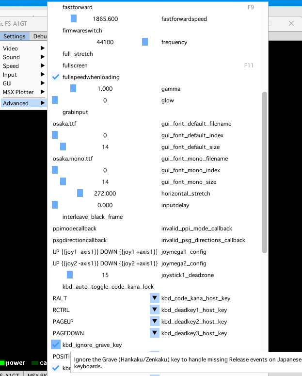

openMSX 21.0-453 for MAmidiMEmo

- openmsx.exe  
  ver. 21.0-443-g4fabfc33f-dirty
  - MAMI非対応
  - 私的な日本向け修正のみ

- openmsx_for_mami.exe  
  ver. 21.0-453-gb387f5df-dirty
  - MAMI対応版  
    - MAmidiMEmoへ演奏情報を送信できます。  
      (MAmidiMEmoは起動時に-chip_serverオプションを付けて起動しておくこと)
  - 私的な日本向け修正

  - 使い方は 
    https://github.com/uniskie/MSX_DOCUMENTS/blob/main/MAmidiMEmoNEMO/readMe.md
    参照

## 私的な日本向け修正:  

- この私家版ビルドのみ
  - ホストPCが日本語配列キーボードの場合、半角/全角キー（漢字キー）を自動的に無視する ← **NEW**  
  - 左右SHIFT同時押し対策を改善（安全版）← **NEW**
  - IME自動抑制

- 公式取り込み済み
  - MSX側のマウスの見た目の速度をホスト側と一致するように修正
    表示倍率が3倍以上だとMSX側のマウスが速すぎる問題への対処
  - テンキーのカンマ入力不能問題の修正 ← **NEW**
  - 起動時とメニュー操作後に起きる入力フォーカス喪失の修正

## リベース元：公式版

リビジョン: 0d462ce723c0850940c348a348d96908c9ea7ad1
作者: Wouter Vermaelen <vermaelen.wouter@gmail.com>
日時: 2026/08/11 火曜日 0:55:27

## 日本語キーボード問題について

公式版OpenMSXでもキー配列（POSITION限定）とUIの日本語化けは対策済みです。
漢字モード自動無効化は入っていませんが、対策(後述)がありますので、
基本的には公式版OpenMSXをお勧めします。

### 公式OpenMSXを使用する際の漢字モード対策

1. Windowsの言語設定にUSを追加
2. US言語のキーボード配列を日本語キーボードに変更
3. OpenMSX使用時に`WINキー`+`スペースキー`でUS/日本の言語モード切り替え

という方法を推奨しています。  
（公式OS依存かつ日本語限定の機能を入れるにはテスター不足なので）

これは洋ゲーをプレイする人も使う方法だそうです。

### 半角/全角キー（漢字キー）問題

openMSXが使用している基本ライブラリであるSDL2には問題があり、
windowsの日本語環境では**半角/全角キーが押しっぱなし**になる問題があります。
（間違えて押してしまったら落ち着いてALT+半角/全角を押してください。）

一旦、openMSX側から半角/全角キーを無視するスイッチを追加しました。

**注意：**

openMSX側で無視するだけなので、
IMEが漢字モードに変わってしまうとopenMSXはすべての文字入力を受け付けなくなります。
前述の「US言語+日本語キーボードモード」等の対策も必要です。  

**使用方法：**

- メニューバーの
  **Settings** → **Advanced** → **kbd_ignore_grave_key** にチェック

- または、コンソールから  
  `set kbd_ignore_grave_key true`⏎

    


### CAPSキー問題

半角/全角キー同様に、
openMSXが使用している基本ライブラリであるSDL2には問題があり、
Windowsの日本語環境では**CAPS LOCKキーが押しっぱなし**になる問題があります。

しかし、半角/全角キーのように単純に無視すればよいという物でもありません。

CAPSキーを無視した場合、bindコマンドで他のキーにMSXのキーマトリクス上のCAPSキ制御を割りてれば良いのですが、別のキーに割り当ててしまうと結構違和感があるかと思います。

そこで、一旦他の対策を提案します。

#### 対策：予防

1. 別のキーにbindする  
   - 例) メニューキーにCAPSキーを割り当てる  
     `F10`キーで出せるコンソールから  
     `bind MENU "keymatrixdown 6 0x08"`  
     `bind MENU,RELEASE "keymatrixup 6 0x08"`  
     
     補足：
     - CAPSキーはMSXキーマトリクス 6行のビットマスク0x08（bit 3）
     - キーダウンとキーリリースの2つの処理を登録
   - sdl_keycode名を使用するため、残念ながら無変換、変換キーは未対応

2. 秀CAPS等で英数とCAPS LOCKを入れ替える  
   - CAPS単体では反応しなくなる
   - **SHIFT+CAPS**でCAPS LOCKの状態を切り替える

#### 対策：**CAPSキーを間違って押してMSXのCAPSランプが点滅して困った場合**

落ち着いて**SHIFT+CAPS**を押して離してください。

SHIFT+CAPSであれば正常認識するので状態回復できます。

## 更新

- openMSX 21.0-443 / 21.0-453 for MAmidiMEmo

  - 日本語キーボードレイアウトかを判定して、
    日本語キーボードレイアウトの場合は半角/全角キー無視。

- openMSX 21.0-408 for MAmidiMEmo

  - __SDLの更新にともなって、__半角/全角キー大暴走が再発し始めたので対策
    → 原因はWindows11の日本語キーボード向け処理の内部変更

- openMSX 21.0-398 for MAmidiMEmo

  - 公式masterのステートロードに失敗するエンバグ修正を取り込み

- openMSX 21.0-393 for MAmidiMEmo

  - マウス速度異常の修正

- openMSX 21.0-392 for MAmidiMEmo

  - 左右シフトキーの扱い修正（安全版）
  - 公式最新リポジトリ取り込み

- openMSX 21.0-386 and "for MAmidiMEmo" ver

  - テンキーのカンマが入力できない問題の修正
  - 公式最新リポジトリ取り込み

- openMSX 21.0-272 and "for MAmidiMEmo" ver

  - 起動時とメニュー操作後に起きる入力フォーカス喪失の修正
  - 公式最新リポジトリ取り込み

- openMSX 21.0-267 and "for MAmidiMEmo" ver

	- 公式リポジトリ取り込み

- openMSX 20.0-98 and "for MAmidiMEmo" ver

  - 公式最新リポジトリに反映されたGUIフォントのマルチバイト文字修正取り込み

- openMSX 20.0-545b and "for MAmidiMEmo" ver

  - 公式最新リポジトリに反映されたGUIフォントの修正取り込み
  - それに伴い、暫定的な日本語フォント対応を取り消し

- openMSX 20.0-521b and "for MAmidiMEmo" ver

  - 公式最新リポジトリの取り込み
  - バージョン表記をmasterリポジトリから自動生成された物に変更
  - GUIで日本語漢字が表示できるように変更（thanks for @pman4416）

- openMSX 20.0-9b and "for MAmidiMEmo" ver

  公式最新リポジトリの取り込み


- openMSX 20.0-8b and "for MAmidiMEmo" ver

  公式最新リポジトリの取り込み

- openMSX 20.0-8b and "for MAmidiMEmo" ver
  
  - メインウィンドウでIMEを無効化するように変更。
    サブウインドウや他のウィンドウでは戻し、メインウィンドウに戻ったら再び無効化する形です。
  
    また setting に kbd_disable_IME を追加しています。
    デフォルト値はtrueで、メインウィドウでIMEを無効化します。
    F10で表示できるコンソールから
    ```set kbd_disable_IME false⏎```
    と入力すれば、IMEを有効化できます。（他のウィンドウに移動してから戻ってみてください）
  
    > 現状、メニューでもサブウィンドウでもMSX側でも日本語を正常処理できない実装なので、意味はないのですが
    > 将来日本語入力表示に対応したいとか、IMEを使いたい場合に有効化できるようにしておきました。

  - （前回の更新補足）
    MAMIへの通信時に接続チェックを挟むようにしたところ、
    リバースバー/ステートロード/マシン一覧/デバイス一覧の速度低下が少し緩和した様子。
  

- openMSX 20.0-7b and "for MAmidiMEmo" ver

  - SHIFTなどの複数存在するキーの同時押しで、どれかを先に離すとMSX側では全部離したことになってしまう問題の対処を追加。
    （秀CAPSなどで「SHIFTを押さずに"_"」機能を使用している場合でも_や♦が入力できます）
    ホストキーボードイベントのみを対象にした管理をしているので副作用は無いと思いますが、暫く検証は必要かと思います。
  
  - MAMIへのrpc送信時に接続状態をチェックして、余計な例外を出さないように修正

- openMSX 20.0-5b and "for MAmidiMEmo" ver

  - キーボード入力できないキーがある問題の修正
    解決できたのはPOSITIONALモードだけです。
  
    > Settings → Input → Keyboard mapping mode: POSITIONAL に設定してください。
  
    **KEYモードやCHARACTERモードは仕様的に問題があるので、私は修正対応するつもりはありません。（出来ません）**
  
    - キースキャンコードがマップされていないUS圏以外のキーを追加
      （"￥"がINTERNATIONAL3、"＼_ろ"がNONUSBACKSLASH）
  
    - 日本語キーボードの"］"が"￥"扱いになってしまう問題の修正
      日本語キーボードの様に、USのバックスラッシュの位置に"]"がある配列の時に位置を補正します。
      （そういう配列の物はNONUSBACKSLASHやINTERNATIONAL3が＼や通貨文字の様子）
  
    ちなみにSHIFT+CAPSでないとCAPSロックが正常動作しない問題は解決が難しいので、SHIFT+CAPSでの入力を徹底するか、別のキーにCAPSをバインドしてみてください。

## 用途や使い方

MAmidiMEmoとの連携方法などは
こちらを参照ください。

https://github.com/uniskie/MSX_DOCUMENTS/blob/main/MAmidiMEmoNEMO/readMe.md

